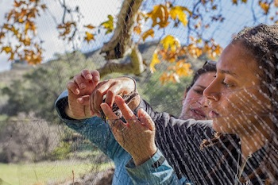

## About me

Hi! My name is Amelia-Juliette Demery (she/her/hers) and I am a PhD student at Cornell University. Here is a little bit about me:

* I am from Los Angeles, California, in the United States of America. 
* I am fascinated by color variation in traits that are deceptively "static". How can seemingly unchanging traits change across space and time?
  + Specifically, I am interested in beak color plasticity in European Starlings and get to induce beak color change in them to investigate the genetics behind that change.
* I am very interested in outreach, specifically policy that serves science. My work here centers around higher education, working to make STEM diverse, equitable, and inclusive.
* My hobbies include tabletop games and soccer. I am a big Manchester United fan and count Marcus Rashford as one of my personal heroes.

## Recent Work
[check out this paper I co-authored with Monique A. Pipkin on promoting safe fieldwork practices in STEM!](https://www-nature-com.proxy.library.cornell.edu/articles/s41559-020-01328-5)